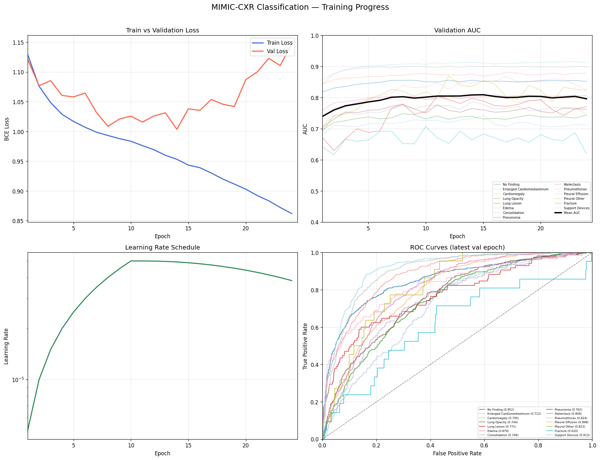
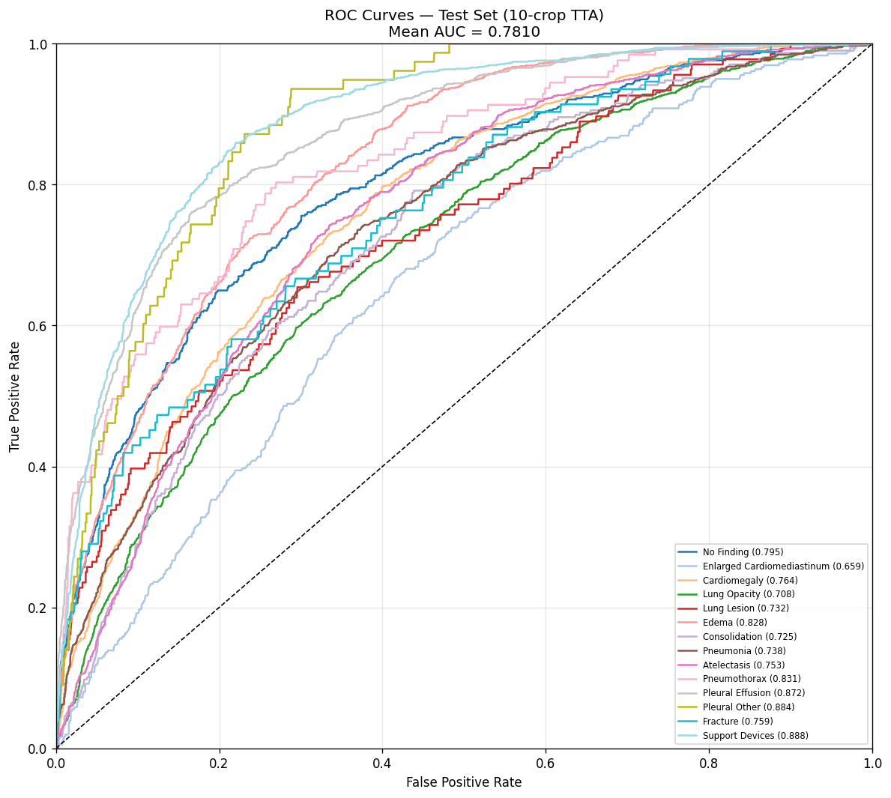

# MIMIC-CXR Multi-Label Classification with Swin Transformer Base

I fine-tuned a **Swin Transformer Base** (ImageNet-21k pretrained) on [MIMIC-CXR v2.0.0](https://physionet.org/content/mimic-cxr/2.0.0/) for 14-class chest X-ray pathology classification, and benchmarked it against [Foundation X (WACV 2025)](https://openaccess.thecvf.com/content/WACV2025/papers/Islam_Foundation_X_Integrating_Classification_Localization_and_Segmentation_through_Lock-Release_Pretraining_WACV_2025_paper.pdf).

---

## Model Architecture

| Component | Details |
|-----------|---------|
| Backbone | `swin_base_patch4_window7_224.ms_in22k` (timm) |
| Pretraining | ImageNet-21k |
| Parameters | 86.8M |
| Input size | 224 × 224 (resized from 256) |
| Output | 14-class sigmoid (multi-label) |
| Loss | Weighted `BCEWithLogitsLoss` (per-class pos_weight) |

---

## Dataset — MIMIC-CXR v2.0.0

| Split | Images |
|-------|--------|
| Train | 237,972 |
| Validation | 1,959 |
| Test | 3,403 |

**Settings I used:**
- Frontal views only (PA + AP) — I excluded lateral views to avoid label noise
- Uncertain labels (`-1`) handled via Label Smoothing Regularization (LSR-Ones): uniform(0.55, 0.85)
- Blank/NaN labels mapped to `0`
- CXR-specific normalization (chest X-ray mean/std)

**14 Pathology Classes:**
No Finding, Enlarged Cardiomediastinum, Cardiomegaly, Lung Opacity, Lung Lesion, Edema, Consolidation, Pneumonia, Atelectasis, Pneumothorax, Pleural Effusion, Pleural Other, Fracture, Support Devices

---

## Training Configuration

| Hyperparameter | Value |
|----------------|-------|
| Optimizer | AdamW |
| Learning rate | 5e-5 (peak) |
| Weight decay | 0.05 |
| Warmup epochs | 10 |
| Total epochs | 50 |
| Batch size | 128 |
| LR schedule | Linear warmup → cosine decay |
| Gradient clipping | 1.0 |
| Min LR | 1e-6 |
| Seed | 42 |
| Hardware | NVIDIA A100-SXM4-80GB |

**Test-time augmentation:** 10-crop TTA

---

## Results

### Per-Class AUC — Test Set (10-crop TTA, best checkpoint at epoch 15)

| Pathology | Swin-B (Mine) | Foundation X |
|-----------|:-------------:|:------------:|
| No Finding | 0.7946 | — |
| Enlarged Cardiomediastinum | 0.6586 | — |
| Cardiomegaly | 0.7639 | — |
| Lung Opacity | 0.7076 | — |
| Lung Lesion | 0.7316 | — |
| Edema | 0.8276 | — |
| Consolidation | 0.7246 | — |
| Pneumonia | 0.7383 | — |
| Atelectasis | 0.7528 | — |
| Pneumothorax | 0.8312 | — |
| Pleural Effusion | 0.8716 | — |
| Pleural Other | 0.8840 | — |
| Fracture | 0.7594 | — |
| Support Devices | 0.8881 | — |
| **Mean AUC** | **0.7810** | **0.7894** |

### Training Curves



### ROC Curves — Test Set



---

## Repository Structure

```
MIMIC_CXR_Classification/
├── train.py                    # Main training + test-only entry point
├── configs/
│   └── config.yaml             # All hyperparameters and paths
├── src/
│   ├── dataset.py              # MIMICCXRDataset with frontal-only filter
│   ├── model.py                # Swin-B builder (timm / ARK+ weights)
│   ├── engine.py               # train_one_epoch, validate, test_tencrop
│   ├── metrics.py              # AUC computation, ROC curves
│   └── visualization.py        # Training progress plots
├── scripts/
│   ├── run_train.sh            # Training launch script
│   └── preprocess_resize.py    # Resize raw images to 256px
├── logs/                       # Training and test logs
└── plots/                      # training_progress.png, final_test_roc.png
```

---

## How to Run

### 1. Preprocess images (one-time)

```bash
python scripts/preprocess_resize.py
```

### 2. Train

```bash
bash scripts/run_train.sh
# smoke test — runs 2 batches to verify the pipeline
bash scripts/run_train.sh --smoke_test
```

Training automatically resumes from `checkpoints/latest.pth` if interrupted.

### 3. Evaluate on the test set

```bash
python train.py --config configs/config.yaml \
    --test_only \
    --resume checkpoints/best_epoch015_auc0.8093.pth
```

---

## Comparison with Foundation X

I compared my results against [Foundation X (Islam et al., WACV 2025)](https://github.com/jlianglab/Foundation_X), a multi-task chest X-ray foundation model pretrained on 11 public datasets using a Cyclic & Lock-Release strategy that jointly trains classification, localization, and segmentation — using the same Swin-B backbone.

| Aspect | Mine | Foundation X |
|--------|------|--------------|
| Pretraining | ImageNet-21k (timm) | 11 CXR datasets (cls + loc + seg) |
| Training data | MIMIC-CXR only | 11 diverse CXR datasets |
| Tasks | Classification only | Classification + Localization + Segmentation |
| Test AUC (MIMIC) | **0.7810** | **0.7894** |

---

## References

```bibtex
@InProceedings{Islam_2025_WACV,
    author    = {Islam, Nahid Ul and Ma, DongAo and Pang, Jiaxuan and Velan, Shivasakthi Senthil and Gotway, Michael and Liang, Jianming},
    title     = {Foundation X: Integrating Classification Localization and Segmentation through Lock-Release Pretraining Strategy for Chest X-ray Analysis},
    booktitle = {Proceedings of the Winter Conference on Applications of Computer Vision (WACV)},
    month     = {February},
    year      = {2025},
    pages     = {3647-3656}
}

@article{johnson2019mimic,
    title     = {MIMIC-CXR, a de-identified publicly available database of chest radiographs with free-text reports},
    author    = {Johnson, Alistair EW and others},
    journal   = {Scientific data},
    volume    = {6},
    number    = {1},
    pages     = {317},
    year      = {2019},
    publisher = {Nature Publishing Group}
}
```
